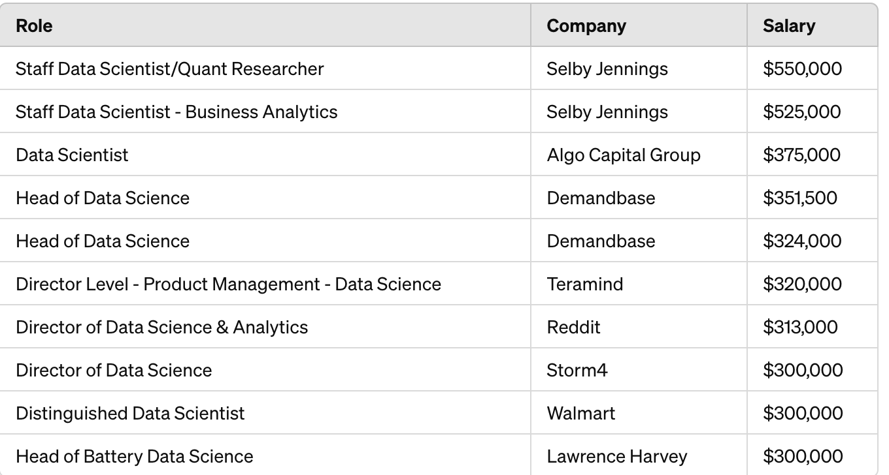
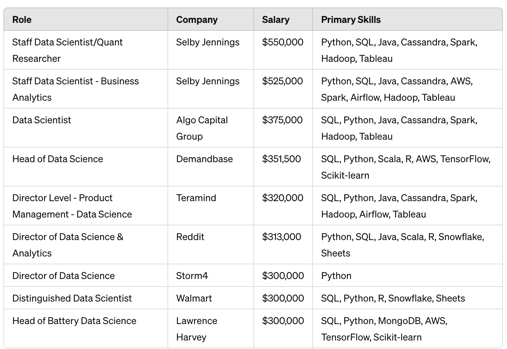
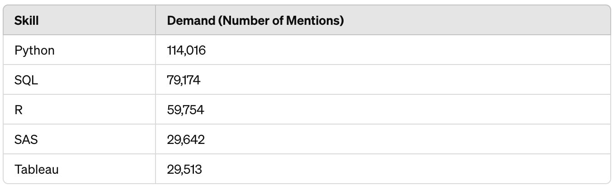
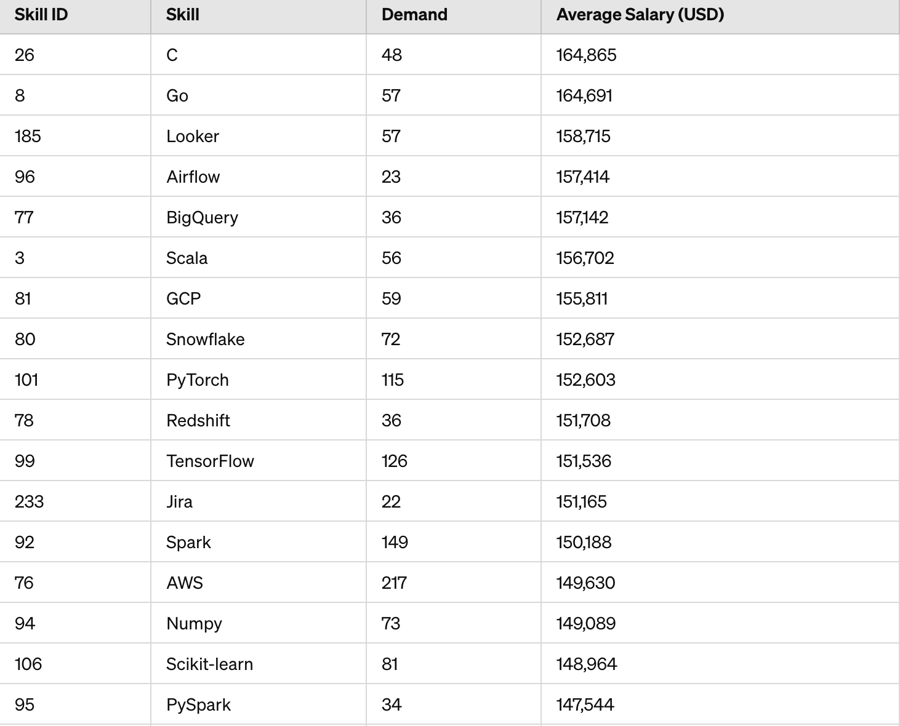

# Introduction 
Dive into the data job market. Focusing on the Data scientist role
This project explore top-paying jobs ,in-demand skills, and where high demand meets high salary in the data analytics
SQL queries? ccheck them out here : [Project_SQL](/Project_SQL/)
# Background
Driven by a quest to navigate the data science job market more effectively, this project was born from a desire to pinpoint top-paid and in-demand skills, streamlining others work to find optimal jobs.

The questions I wanted to answer through my SQL queries were:

1. What are the top-paying data analyst jobs?
2. What skills are required for these top-paying jobs?
3. What skills are most in demand for data analysts?
4. Which skills are associated with higher salaries?
5. What are the most optimal skills to learn?


# Tools I used
For my deep dive into the data science job market, I harnessed the power of several key tools:
- **SQL**: The backbone of my analysis, allowing me to query the database and unearth critical insights.
- **PostgreSQL**: The chosen database management system, ideal for handling the job posting data.
- **Visual Studio Code**: My go-to for database management and executing SQL queries.
- Git & GitHub: Essential for version control and sharing my SQL scripts and analysis, ensuring collaboration and project tracking.

# The Analysis
### 1. Top Paying Data Analyst Jobs
To identify the highest-paying roles, I filtered data science positions by average yearly salary and location, focusing on remote jobs. This query highlights the high paying opportunities in the field.
```sql
SELECT
name,
job_postings_fact.job_title,
job_postings_fact.job_location,
salary_year_avg,
job_postings_fact.job_schedule_type
,job_posted_date
FROM
job_postings_fact
LEFT JOIN company_dim ON company_dim.company_id=job_postings_fact.company_id
WHERE  job_postings_fact.job_title = 'Data Scientist'
AND salary_year_avg IS NOT NULL
AND job_postings_fact.job_location ='Anywhere'
ORDER BY  salary_year_avg DESC 
LIMIT 10;
```
*Algo Capital Group offers a top salary of $375,000, making it the highest-paying role for a Data Scientist position listed as full-time and remote.

*Smith Hanley Associates and Grammarly provide competitive salaries for remote Data Scientist roles, with offerings of $250,000 and $204,500, respectively.

*Additional notable companies like Cisco and Storm2 offer salaries close to $200,000 for similar positions, highlighting the lucrative opportunities available in the field.

Top 10 salaries for the data scientist roles: Chat Gpt generated this table from my SQL query
### 2. Top Paying SKills for Data science 

High Demand Skills: Python and SQL are the most in-demand skills, crucial for high-paying Data Scientist roles. Python appeared in 10 job listings, while SQL appeared in 8, highlighting their foundational importance in data science.
```sql
with top_paying_jobs AS 
(
SELECT
job_id,
name AS Company_NAME,
job_postings_fact.job_title,
salary_year_avg
FROM
job_postings_fact
LEFT JOIN company_dim ON job_postings_fact.company_id =  company_dim.company_id
WHERE  job_postings_fact.job_title = 'Data Scientist'
AND salary_year_avg IS NOT NULL
AND job_postings_fact.job_location ='Anywhere'
ORDER BY  salary_year_avg DESC 
LIMIT 10
)
SELECT

top_paying_jobs.*,
skills_dim.skills

FROM
top_paying_jobs

JOIN skills_job_dim  ON   skills_job_dim.job_id=top_paying_jobs.job_id
JOIN    skills_dim  ON skills_dim.skill_id=skills_job_dim.skill_id
```


Top paying skills 
Chat Gpt generated this table from my SQL query

### 3. Top Demanded SKills for Data science 

Python Dominates Demand: Python is the most demanded skill among data scientists, with 114,016 mentions, indicating its critical role in data science and analytics work across various industries.

SQL and R Also Vital: SQL and R are also highly sought after, with 79,174 and 59,754 mentions respectively, highlighting their importance in data management and statistical analysis within the data science field.

```sql
SELECT
skills
,
COUNT(skills_job_dim.job_id) as Demand_skills
from job_postings_fact

INNER JOIN skills_job_dim ON  job_postings_fact.job_id=skills_job_dim.job_id 
INNER JOIN  skills_dim ON  skills_job_dim.skill_id=skills_dim.skill_id

WHERE 

job_title_short='Data Scientist'

GROUP BY skills
ORDER BY Demand_skills DESC

LIMIT 5;
```


Top Demanded skills 
Chat Gpt generated this table from my SQL query


4. Top paying skills

Premium on Collaboration and Management Tools: Skills related to project management and collaboration tools such as Asana and Airtable command the highest salaries, topping at $215,477 and $201,143 respectively, indicating a high value placed on efficient project management and team collaboration capabilities.

High Value in Niche Technologies: Specialized technologies like RedHat, Watson, and Solidity also fetch high average salaries, suggesting that niche skills that cater to specific technologies or industries are highly lucrative.

Consistent Demand for Data Technologies: Traditional data science skills like TensorFlow, Spark, and BigQuery show consistently high salary levels, underscoring the ongoing need for data processing and analysis expertise in the tech industry.


```sql
SELECT
skills
,
round (AVG(salary_year_avg),0)  AS avg_salary
from job_postings_fact

INNER JOIN skills_job_dim ON  job_postings_fact.job_id=skills_job_dim.job_id 
INNER JOIN  skills_dim ON  skills_job_dim.skill_id=skills_dim.skill_id

WHERE 

job_title_short='Data Scientist'

AND salary_year_avg is NOT NULL

GROUP BY skills
ORDER BY 
avg_salary DESC

LIMIT 40;
```


 [Top Paid skills](assets/4.png)
Top Paid skills 
Chat Gpt generated this table from my SQL query


5. Optimal skills

Python Dominates Demand: Python is the most demanded skill among data scientists, with 114,016 mentions, indicating its critical role in data science and analytics work across various industries.

SQL and R Also Vital: SQL and R are also highly sought after, with 79,174 and 59,754 mentions respectively, highlighting their importance in data management and statistical analysis within the data science field.

```

WITH  A AS(
SELECT
skills_dim.skill_id,
skills_dim.skills
,
COUNT(skills_job_dim.job_id) as SKILLS_DEMAND
from job_postings_fact
INNER JOIN skills_job_dim ON  job_postings_fact.job_id=skills_job_dim.job_id 
INNER JOIN  skills_dim ON  skills_job_dim.skill_id=skills_dim.skill_id
WHERE 
job_title_short='Data Scientist'
and job_work_from_home= TRUE
AND salary_year_avg is NOT NULL
GROUP BY skills_dim.skill_id 
),

B  AS
(
SELECT
skills
,
skills_dim.skill_id,
round (AVG(salary_year_avg),0)  AS avg_salary
from job_postings_fact
INNER JOIN skills_job_dim ON  job_postings_fact.job_id=skills_job_dim.job_id 
INNER JOIN  skills_dim ON  skills_job_dim.skill_id=skills_dim.skill_id
WHERE 
job_title_short='Data Scientist'
AND salary_year_avg is NOT NULL
and job_work_from_home= TRUE
GROUP BY skills_dim.skill_id 
)
SELECT
A.skill_id ,
A.skills,
A.SKILLS_DEMAND,
B.avg_salary
from A
join     B  ON  B.skill_id=a.skill_id
WHERE SKILLS_DEMAND>15
ORDER BY avg_salary DESC,
SKILLS_DEMAND DESC
LIMIT 25;
```

Top Optimal skills 
Chat Gpt generated this table from my SQL query


# What I Learned

Throughout this adventure, I've turbocharged my SQL toolkit with some serious firepower:

- **Complex Query Crafting:** Mastered the art of advanced SQL, merging tables like a pro and wielding WITH clauses for ninja-level temp table maneuvers.
- **Data Aggregation:** Got cozy with GROUP BY and turned aggregate functions like COUNT() and AVG() into my data-summarizing sidekicks.
- **Analytical Wizardry:** Leveled up my real-world puzzle-solving skills, turning questions into actionable, insightful SQL queries.


# Conclusions
1.High Salaries for Remote Roles: The analysis underscored the existence of high-paying remote roles in the data science field, with companies like Algo Capital Group offering up to $375,000. This reflects a growing trend towards high valuation of data science expertise, regardless of geographical location.

2.Crucial Skills Driving Salaries: Essential skills such as Python and SQL are not just popular; they are pivotal in securing top-paying data science roles. Their frequent appearance in job listings underscores their foundational role in the field.

3.Demand and Supply of Skills: The study further illustrated that while Python dominates in demand with over 114,000 mentions, other technical skills like R, SQL, and specialized tools like AWS also show substantial demand. This suggests a broad and diverse skill set is highly valued in the marketplace.

4.Project Management and Collaboration Tools: Tools like Asana and Airtable, which facilitate project management and team collaboration, command the highest average salaries. This suggests that roles requiring organizational skills and the ability to manage workflows efficiently are highly valued, possibly due to the increasing complexity of tech projects and the premium on effective team coordination.

5.Tools for Enhanced Analysis and Collaboration: Utilizing SQL for querying, PostgreSQL for database management, and Visual Studio Code for executing SQL queries effectively facilitated the analysis. Moreover, tools like Git & GitHub were essential for version control and collaboration, highlighting the importance of technical proficiency beyond traditional data science skills.

